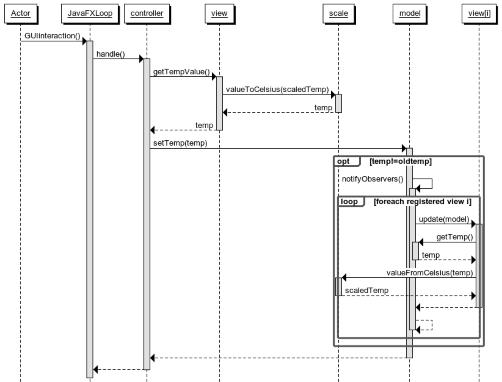

# Temperature

Creare un programma Java che permetta di gestire la temperatura di attivazione
di un termostato. La possibilità di leggere o impostare la temperatura può
avvenire tramite diverse viste, in particolare la temperatura viene visualizzata
sia in gradi Celsius che Fahrenheit; l'utente può impostare la temperatura in
entrambe le scale, tutte le viste devono essere coordinate sulla temperatura di
attivazione mostrata all'utente.

### Requisiti informali

Il progetto deve tener conto dei seguenti requisiti:

*  Le viste ci permettono di leggere e di impostare la temperatura usando diverse scale (unità di misura). Sono richieste 2 viste:
(1) un [TextField](https://openjfx.io/javadoc/13/javafx.controls/javafx/scene/control/TextField.html) in gradi Celsius, (2) un [TextField](https://openjfx.io/javadoc/13/javafx.controls/javafx/scene/control/TextField.html) in gradi Fahrenheit. Tutte le viste devono essere in grado di *osservare* un cambiamento di temperatura nel termostato in modo da aggiornarsi ed essere allineate sul valore mostrato all'utente.

* Una componente chiamata `Model` si occupa di mantenere il dato *temperatura*
  tramite un `double` che rappresenta la misura in gradi Celsius. E' unica e
  comune a tutte le viste. Il `Model` a fronte di un cambiamento della
  temperatura, deve occuparsi di *notificare* tutte le viste. Internamente
  mantiene le temperature secondo la scala Celsius.

*  Una componente chiamata `Controller` sta nel mezzo tra `View` e `Model` ed
   interpreta l’input dell’utente (l’inserimento di un valore nel text field).
   Un'istanza di `Controller` (una per ogni vista) a fronte dell'interazione
   dell'utente deve aggiornare il `Model` con la nuova temperatura appena
   immessa.

Di seguito viene fornita la definizione di quella che sarà la funzionalità dell'*MVC* tramite un *sequence diagram*.

Lo schema riporta le azioni intraprese a fronte di una modifica di una vista:

- l'interfaccia grafica (`JavaFXLoop`) richiama il `Controller` (L'`EventHandler` dell'`ActionEvent`);
- il `Controller` interroga la `View` collegata chiedendo il *valore* della temperatura;
- la `View` si occupa di tradurlo dalla sua *scala* di visualizzazione a quella Celsius usata dal `Model`; 
- il `Controller` chiama il `Model` passando come parametro il nuovo *valore* della temperatura;
- il `Model` aggiorna il proprio stato interno (nuovo *valore* per la temperatura);
- il `Model` notifica tutte le `View` registrate sul `Model` come `Observer`;
- ogni `View` chiede al `Model` (modalità **pull**) il  nuovo *valore* e aggiorna l'interfaccia grafica dopo averlo convertito nella propria scala.

### Suggerimenti

Di seguito si accenna ad alcuni *design pattern* che risultano essere particolarmente indicati per svolgere l'esercizio:

* L'aggiornamento delle viste a fronte di un cambiamento del model può essere realizzata attraverso il pattern *observer*. Le viste interessate si registrano sul `Model` che è il *subject*.
* Per consentire l'utilizzo di diverse scale (bisogna trattare almeno Celsius e Fahrenheit, ma è *previsto* che ce ne saranno altre) per la rappresentazione della temperatura è possibile utilizzare il pattern *strategy*. 
* Ogni strategy essendo *stateless* può essere implementata come un Singleton.
* Una `View` potrebbe essere implementata attraverso l'uso di un *composite*. Infatti una vista è solitamente una gerarchia di componenti grafici (labels, buttons, text entry, ecc.).

## TDD

Nella soluzione dell'esercizio è utile procedere in modalità TDD, cioè
descrivendo prima l'obbiettivo che si vuole ottenere tramite un test di unità e
poi implementando la funzionalità che permette al test di passare.

Il codice fornito contiene già alcuni test che suggeriscono come procedere
(ATTENZIONE: alcuni di questi al momento non compilano correttamente perché
mancano le classi necessarie). Alcuni test utilizzano oggetti creati con una
libreria di *mocking*.

Ulteriori *test di unità* possono essere immaginati estraendo le colonne del *sequence diagram* relative ai vari componenti:

- Ogni freccia entrante (non le frecce tratteggiate, le quali indicano i valori di ritorno) è una stimolazione che bisogna provare. Non occorre creare l'oggetto chiamante: sarà  il metodo di test (ovvero il *driver*) a effettuare questa operazione.
- Seguendo il flusso dei messaggi è possibile identificare eventuali *double object*, osservando cosa succede fino alla fine della chiamata di metodo:
    - Se viene effettuata una chiamata, ma non è presente un valore di ritorno, verificheremo di aver richiamato correttamente il metodo (usando `verify` di *mockito*);
	- Se al termine della chiamata viene restituito qualcosa, dobbiamo predisporre uno *stub* (usando `when` di *mockito*). La verifica probabilmente verrà  fatta in maniera *indiretta* in quanto verificheremo il corretto processamento del valore restituito.		
- Per verificare la corretta esecuzione, è possibile usare le seguenti primitive:
	- `assertThat`: sul valore restituito dai metodi del SUT;
	- `verify`: sulle chiamate di metodo e parametri dal SUT a *double object*;
	- `assertThat`: sullo stato del SUT.

## Verifica e Convalida

### Integration Test

Il test di integrazione (che va completato opportunamente) stimolerà con una
modifica una *view* e farà asserzioni sulle modifiche conseguenti nelle altre
*view*. Le *view* verranno quindi testate utilizzando opportunamente la libreria
TestFX per verificare le modifiche dal punto di vista esterno (a livello di
*GUI*).

